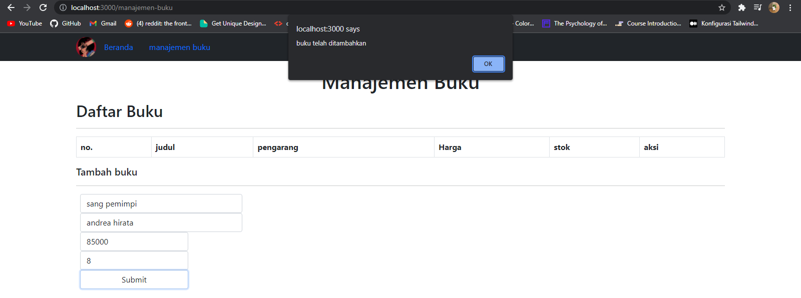

# BOOK MANAGEMENT
THIS IS REPOSITORY I MADE WHILE LEARNING ON CAMP404 BOOTCAMP 

# url 
http://localhost:3000/

# demo 

# how to use my project

<ul>
  <li>Install NodeJS, npm, MongoDB, ReactJS</li>
  <li>Install Cors,Nodemon, Morgan, express, mongoose and axios </li>
  <li>git clone this repo</li>
  <li>run the backend with "nodemon server.js" from backend directory</li>
  <li>run the react from public directory with "npm start"</li>
</ul>
